Analysis of RNAseq data
========================================================
author:MRC LMS Bioinformatics Core
date: 20 September 2019
width: 1440
height: 1100
autosize: true
font-import: <link href='http://fonts.googleapis.com/css?family=Slabo+27px' rel='stylesheet' type='text/css'>
font-family: 'Slabo 27px', serif;
css:style.css


RNA-seq analysis pipeline
====================================

<div align="center">
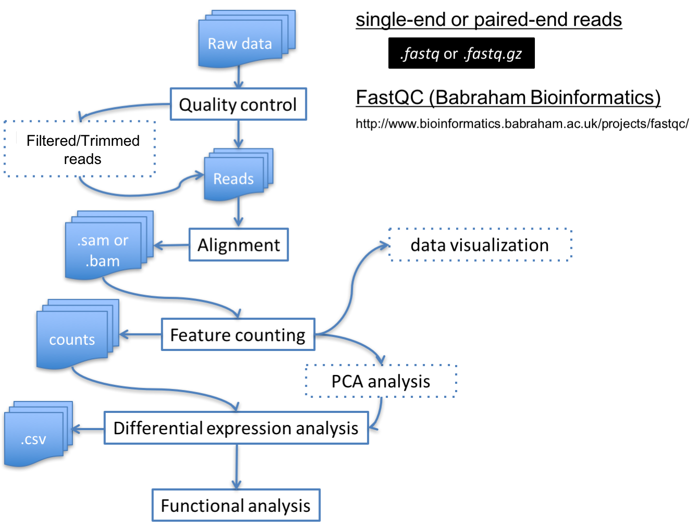
</div>


Contents
====================================
* [Quality Assessment](#/quality).
* Read alignment (covered by the theory).
* Read feature counting (covered by the theory).
* [Differential gene expression analysis](#/de).
* [Exploring and saving results](#/explore).
* [Functional analysis - Gene Ontology](#/go).


Quality Assessment - FastQC (1/2)
====================================
id: quality

<div align="center">

</div>


Quality Assessment - FastQC (2/2)
====================================

<div align="center">

</div>


Check before you carry on ...
========================================================

* What genome is involved?
   - Is it a well annotated organism or a poorly annotated one?
   - A different analysis strategy depending on the genome?

* Single end or Paired end sequencing experiment?

* Strand specific or non stand specific
  - Useful to distinguish sense and antisense transcripts  


unstranded RNAseq
========================================================

<div align="center">
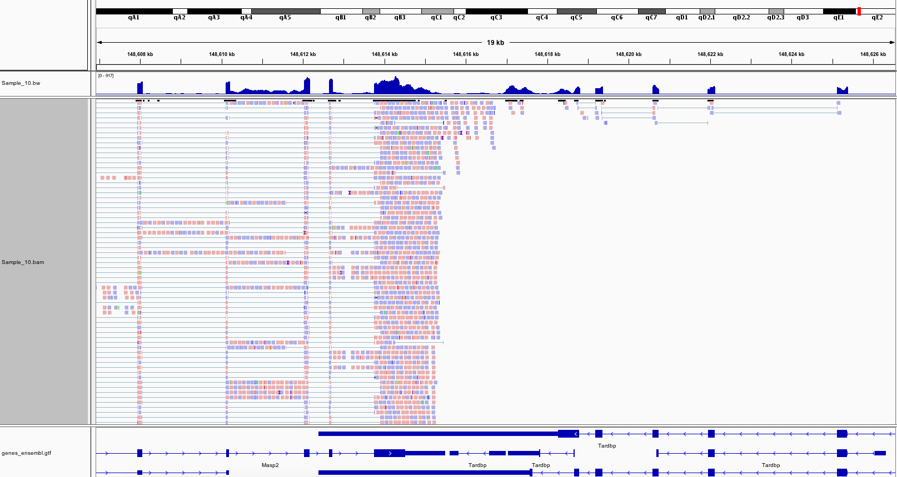
</div>

Masp2 (sense) and Tardbp (antisense)

fr-firststrand RNAseq
========================================================

<div align="center">
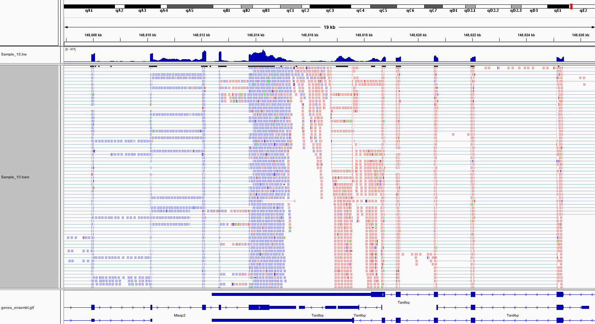
</div>

Masp2 (sense) and Tardbp (antisense)

========================================================

<div align="center">
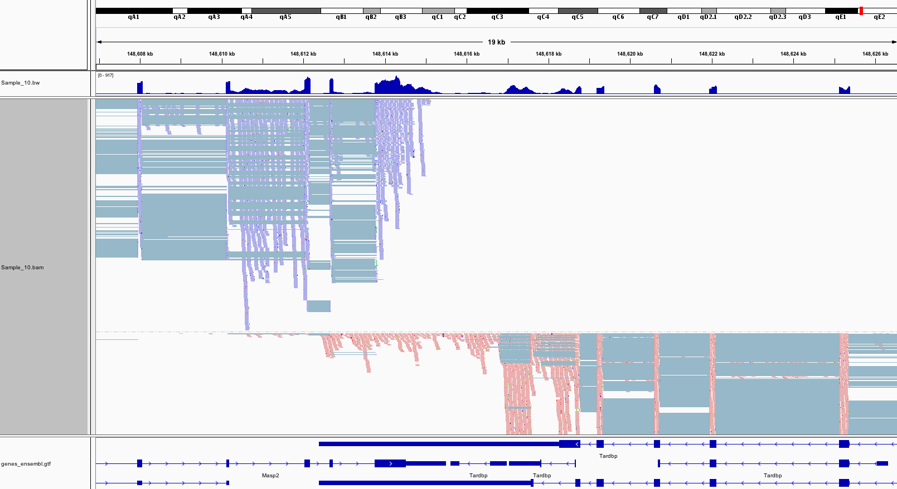
</div>

Masp2 (sense) and Tardbp (antisense)


Read Counting (1/2)
====================================
id: counting

After alignment, next step is to assign reads to features such as genes, transcripts
or exons.

* htseq-count

	Anders et al., 2014. Bioinformatics. 31(2):166-9
	
* featurecount function in Rsubread R package

	Liao et al., 2014. Bioinformatics. 30(7):923-30


Read Counting (2/2)
====================================

<div align="center">
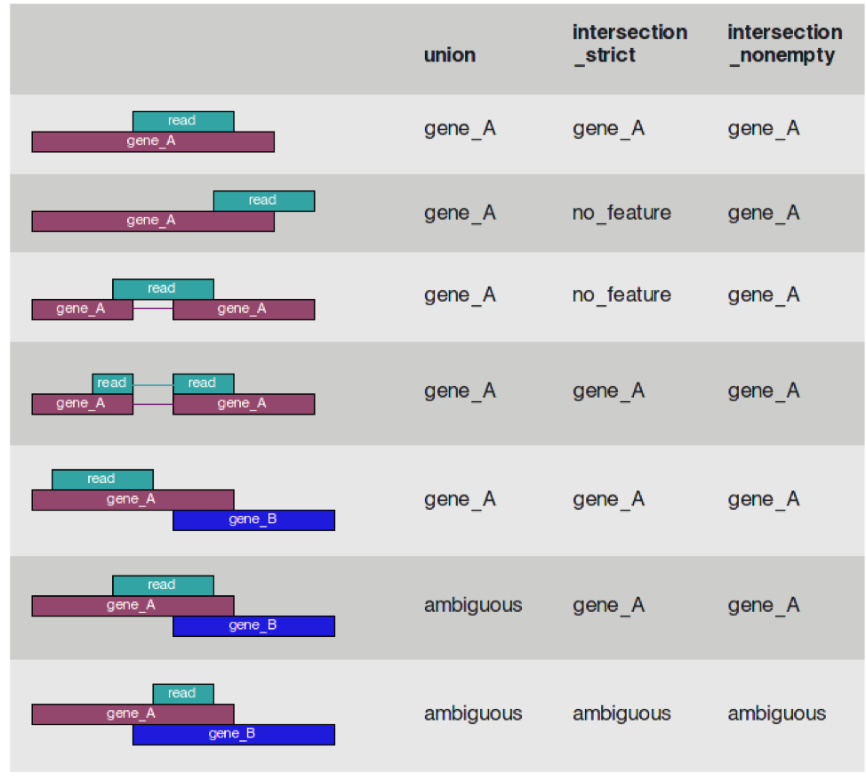
</div>
	
http://htseq.readthedocs.io/en/master/count.html


Check before you carry on again ...
========================================================

* How many factors involved in experiment (genotype, treatment, time course etc.)

   - Single factor vs multi factor analysis? 
   
   - Interactions?
   
* In this session, we will only discuss the single factor analysis
   
   

RNA-seq analysis pipeline
====================================

<div align="center">

</div>


Set working directory
========================================================

Before running any of the code, we need to set the working directory to the folder we unarchived. 
You may navigate to the unarchived LMS_RNAseq_short/course folder in the Rstudio menu

**Session -> Set Working Directory -> Choose Directory**

<div align="center">

</div>


Set working directory - in the console
========================================================

Use the getwd() to see where your current directory is


```r
getwd()
```

Use setwd() to set up your directory in the console


```r
setwd("/Users/skhadaya/RNAseq_CBW2019/course")
```


Material
====================================

Dataset
* [GSE68360] (http://www.ncbi.nlm.nih.gov/geo/query/acc.cgi?acc=GSE68360)

We have generated the following files for this session.

- **target** file that contain the sample information.

targets.txt

- **count** matrix  containing count table

AllCounts.csv


Read sample information
========================================================
id: de

Read in **targets.txt** file by using read.table function


```r
targets <- read.table("targets.txt",sep="\t",header=TRUE)  

targets
```

```
  Sample Group Batch        InputFile       InputFile2 OutputFile
1   Viv1   Viv     a SRR2001243.fastq SRR2001244.fastq   Viv1.bam
2   Viv2   Viv     b SRR2001245.fastq SRR2001246.fastq   Viv2.bam
3   Viv3   Viv     c SRR2001247.fastq SRR2001248.fastq   Viv3.bam
4   Hfd1   Hfd     a SRR2001249.fastq SRR2001250.fastq   Hfd1.bam
5   Hfd2   Hfd     b SRR2001251.fastq SRR2001252.fastq   Hfd2.bam
6   Hfd3   Hfd     c SRR2001253.fastq SRR2001254.fastq   Hfd3.bam
```

Read count data
========================================================

Load count data by using read.csv function


```r
AllCounts<-read.csv(file="AllCounts.csv",row.names = 1)
```

 Show first few rows of "AllCounts" object and the class of AllCounts object


```r
head(AllCounts)
```

```
                   Viv1 Viv2 Viv3 Hfd1 Hfd2 Hfd3
ENSMUSG00000090025    0    0    0    0    0    0
ENSMUSG00000064842    0    0    0    0    0    0
ENSMUSG00000051951    0    1    1    3    0    0
ENSMUSG00000089699    0    0    0    0    0    0
ENSMUSG00000088390    0    0    0    0    0    0
ENSMUSG00000089420    0    0    0    0    0    0
```

```r
class(AllCounts)
```

```
[1] "data.frame"
```


Prepare deseqdataset object 
========================================================

 Collect sample information


```r
cData<-data.frame(name=targets$Sample,
                  Group=targets$Group,
                  Batch=targets$Batch)

rownames(cData)<-cData[,1]
```


Prepare deseqdataset object (Continued)
========================================================

 Construct deseqdataset object

The class used by the DESeq2 package to store the read counts is **DESeqDataSet**.


```r
library(DESeq2)

dds<-DESeqDataSetFromMatrix(
    countData= AllCounts,colData=cData,
    design=~Group)
```

Differential expression analysis
========================================================

The standard differential expression analysis steps are wrapped into a single function, **DESeq**,
which performs normalization, fitting to the model and statistical testing.


```r
dds<-DESeq(dds)

?DESeq
```

The function DESeq runs the following functions in order,

**estimateSizeFactors()**

**estimateDispersions()**

**nbinomWaldTest()**


DESeq function - estimateSizeFactors()
========================================================


1 - **Estimation of size factors**

The sizeFactors vector assigns to each column of the count matrix a value, the size factor, such that  count  values  in  the  columns  can  be  brought  to  a  common  scale  by  dividing  by  the  corresponding size factor.


```r
#  estimateSizeFactors()

sizeFactors(dds)
```

```
     Viv1      Viv2      Viv3      Hfd1      Hfd2      Hfd3 
1.2430187 0.7755226 1.0501449 0.9457439 1.0124687 1.0515602 
```

Calculating  sizeFactors
========================================================

<div align="center">
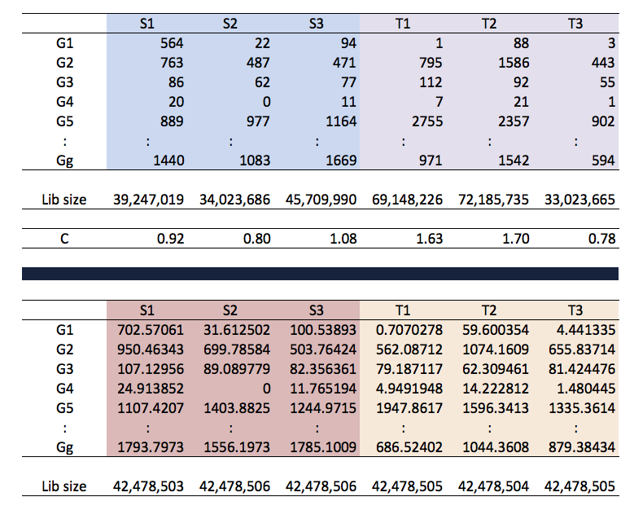
</div>

DESeq2 calculation of the sizeFactors 
========================================================

Please refer to Equation (5):

**Anders S and Huber W. (2010). Differential expression analysis for sequence count data. *Genome Biol.*:11(10):R106.**

$$
\hat{s_{j}}=\begin{matrix}
  median \\
  i
 \end{matrix}\frac{k_{ij}}{(\prod_{v=1}^{m}k_{iv})^{1/m}}
 
 \\
 \hat{s_{j}}:\text{estimated size factor for the jth sample}
 \\
 
$$
The denominator of this expression can be interpreted as a pseudo-reference sample obtained by taking the geometric mean across samples. Thus, each estimated size factor is computed as the median of the ratios of the j-th sample's counts to those of the pseudo-reference.


DESeq function - estimateDispersions()
========================================================

2 - **Estimation of dispersion**

This function obtains gene-wide dispersion estimates. Then, a curve is fit to the estimates to capture the overall trend of dispersion-mean dependence. 


```r
#  estimateDispersions()

head(dispersions(dds))
```

```
[1]       NA       NA 2.495857       NA       NA       NA
```

```r
plotDispEsts(dds)
```

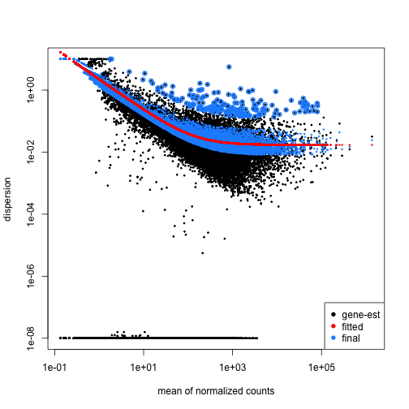


DESeq function - nbinomWaldTest()
========================================================
3- **Hypothesis test for differential expression**


For significance testing, DESeq2 by default uses a Wald test, where
the function tests whether each model coefficient differs significantly from zero, using previously calculated sizeFactors and dispersion estimates.

The Wald test P values  are adjusted for multiple testing using the procedure of Benjamini and Hochberg.


```r
nbinomWaldTest()
```


Getting results
========================================================

Results tables are generated using the function **results()**, which extracts a results table with log2 fold changes, p  values and adjusted p values.

 Use the function "results()"


```r
res<-results(dds) 
```

 Order results by adjusted p value


```r
resOrdered<-res[order(res$padj),]

?results      
```


Getting results
========================================================


```r
head(resOrdered)
```

```
log2 fold change (MLE): Group Viv vs Hfd 
Wald test p-value: Group Viv vs Hfd 
DataFrame with 6 rows and 6 columns
                           baseMean    log2FoldChange             lfcSE
                          <numeric>         <numeric>         <numeric>
ENSMUSG00000032080  14291.817820761 -5.04940305923945 0.251952097635319
ENSMUSG00000024526  465.87904057095 -6.89875038071526  0.34659786372613
ENSMUSG00000069170 343.928323594871 -4.05808344768568 0.253507932847091
ENSMUSG00000042041 651.002326876615 -3.18879830769903  0.20366517802941
ENSMUSG00000032231 883.324337619713 -2.58604293458338 0.176729903620997
ENSMUSG00000026043 833.867936897615 -2.46575350121176 0.171552106859386
                                stat               pvalue
                           <numeric>            <numeric>
ENSMUSG00000032080 -20.0411233191956 2.41261013993144e-89
ENSMUSG00000024526 -19.9041918682062 3.74278923935366e-88
ENSMUSG00000069170 -16.0077177945095 1.12874721852708e-57
ENSMUSG00000042041 -15.6570619413327 2.97318548586217e-55
ENSMUSG00000032231 -14.6327411581078 1.73647573696414e-48
ENSMUSG00000026043 -14.3732044237313 7.62213368291837e-47
                                   padj
                              <numeric>
ENSMUSG00000032080 4.02471623543363e-85
ENSMUSG00000024526 3.12186050454489e-84
ENSMUSG00000069170 6.27658703315625e-54
ENSMUSG00000042041 1.23996700687882e-51
ENSMUSG00000032231 5.79357764880717e-45
ENSMUSG00000026043 2.11920723497407e-43
```

Add Gene symbol
========================================================


```r
# Add Gene Symbols
library(biomaRt)

# retrieve the mm9 information from biomart
mart=useMart('ENSEMBL_MART_ENSEMBL',dataset='mmusculus_gene_ensembl',
             host="may2012.archive.ensembl.org")

bm<-getBM(attributes=c('ensembl_gene_id','mgi_symbol'),
          filters ='ensembl_gene_id',
          values=rownames(resOrdered), mart=mart)

# see the first few rows of "bm" object
head(bm)      
```

```
     ensembl_gene_id mgi_symbol
1 ENSMUSG00000000078       Klf6
2 ENSMUSG00000000325      Arvcf
3 ENSMUSG00000000340        Dbt
4 ENSMUSG00000000915      Hip1r
5 ENSMUSG00000001095    Slc13a2
6 ENSMUSG00000001119     Col6a1
```

Add Gene symbol (Continued)
========================================================


```r
# merge the Gene_symbol to our DE dataset
resAnnotated <- merge(as.data.frame(resOrdered),bm,by.x=0,by.y=1)
head(resAnnotated)
```

```
           Row.names     baseMean log2FoldChange     lfcSE        stat
1 ENSMUSG00000000001 2.438865e+03    -0.01014313 0.1128504 -0.08988119
2 ENSMUSG00000000003 0.000000e+00             NA        NA          NA
3 ENSMUSG00000000028 3.803191e+01    -0.27265098 0.3757113 -0.72569288
4 ENSMUSG00000000031 1.419411e+01    -2.87882064 0.6654750 -4.32596354
5 ENSMUSG00000000037 4.993369e-01    -2.44601888 2.6091665 -0.93747136
6 ENSMUSG00000000049 3.907640e+04     0.11127605 0.1400379  0.79461373
        pvalue         padj mgi_symbol
1 9.283816e-01 0.9763669677      Gnai3
2           NA           NA       Pbsn
3 4.680271e-01 0.7711998763      Cdc45
4 1.518665e-05 0.0003671649        H19
5 3.485161e-01           NA      Scml2
6 4.268382e-01 0.7439677545       Apoh
```

```r
# change the column name
colnames(resAnnotated)[1]<-"ensembl_gene_id"
```

Add Gene symbol (Continued)
========================================================


```r
# Order results by adjusted p value
resAnnotated<-resAnnotated[order(resAnnotated$pvalue,decreasing=F),]

# show the result with gene symbol annotation
head(resAnnotated)
```

```
         ensembl_gene_id   baseMean log2FoldChange     lfcSE      stat
8820  ENSMUSG00000032080 14291.8178      -5.049403 0.2519521 -20.04112
4582  ENSMUSG00000024526   465.8790      -6.898750 0.3465979 -19.90419
20354 ENSMUSG00000069170   343.9283      -4.058083 0.2535079 -16.00772
12526 ENSMUSG00000042041   651.0023      -3.188798 0.2036652 -15.65706
8894  ENSMUSG00000032231   883.3243      -2.586043 0.1767299 -14.63274
5372  ENSMUSG00000026043   833.8679      -2.465754 0.1715521 -14.37320
            pvalue         padj    mgi_symbol
8820  2.412610e-89 4.024716e-85         Apoa4
4582  3.742789e-88 3.121861e-84         Cidea
20354 1.128747e-57 6.276587e-54         Gpr98
12526 2.973185e-55 1.239967e-51 2010003K11Rik
8894  1.736476e-48 5.793578e-45         Anxa2
5372  7.622134e-47 2.119207e-43        Col3a1
```

Saving DEseq2 results
========================================================

Save the result in ".txt" or ".csv" format


```r
write.table(resAnnotated,file="DESeq_result.txt",sep="\t")
write.csv(resAnnotated,file="DESeq_result.csv",  row.names=F)
```

<div align="center">
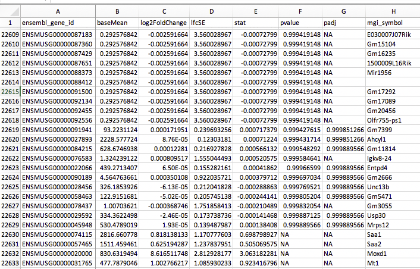
</div>

Exploring results
========================================================

We can summarize some basic tallies using the summary function.


```r
summary(res)
```

```

out of 22605 with nonzero total read count
adjusted p-value < 0.1
LFC > 0 (up)       : 992, 4.4%
LFC < 0 (down)     : 1459, 6.5%
outliers [1]       : 7, 0.031%
low counts [2]     : 5916, 26%
(mean count < 3)
[1] see 'cooksCutoff' argument of ?results
[2] see 'independentFiltering' argument of ?results
```

```r
# How many adjusted p-values were less than 0.05?
sum(res$padj < 0.05, na.rm=TRUE)
```

```
[1] 1970
```

How DESeq2 defines outliers - cooksCutoff
========================================================

theshold on Cook's distance, such that if one or more samples for a row have a distance higher, the p-value for the row is set to NA.


```r
summary(res)
```

```

out of 22605 with nonzero total read count
adjusted p-value < 0.1
LFC > 0 (up)       : 992, 4.4%
LFC < 0 (down)     : 1459, 6.5%
outliers [1]       : 7, 0.031%
low counts [2]     : 5916, 26%
(mean count < 3)
[1] see 'cooksCutoff' argument of ?results
[2] see 'independentFiltering' argument of ?results
```

How DESeq2 filters low counts - independentFiltering
========================================================

A threshold on the filter statistic is found which optimizes the number of adjusted p values lower than a significance level alpha (we use the standard variable name for significance level, though it is unrelated to the dispersion parameter α). The theory behind independent filtering is discussed in greater detail below. The adjusted p values for the genes which do not pass the filter threshold are set to NA.


```r
summary(res)
```

```

out of 22605 with nonzero total read count
adjusted p-value < 0.1
LFC > 0 (up)       : 992, 4.4%
LFC < 0 (down)     : 1459, 6.5%
outliers [1]       : 7, 0.031%
low counts [2]     : 5916, 26%
(mean count < 3)
[1] see 'cooksCutoff' argument of ?results
[2] see 'independentFiltering' argument of ?results
```

MA plot
========================================================

The  function **plotMA()** shows  the  log2  fold  changes  attributable  to  a  given  variable  over  the  mean of normalized counts.  Points will be colored red if the adjusted p value is less than 0.1.  Points which fall out of the window are plotted as open triangles pointing either up or down.


```r
plotMA(res, main="DESeq2", ylim=c(-4,4))
```

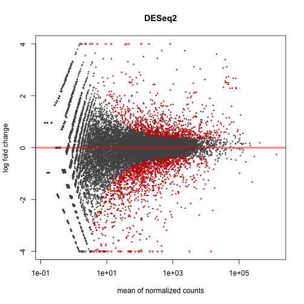

After calling plotMA, we can use the function identify to interactively detect the row number of individual
genes by clicking on the plot. 
Recover the gene identifiers by saving the resulting indices:


```r
idx <- identify(res$baseMean, res$log2FoldChange)
rownames(res)[idx]
```


Plot counts
========================================================
 **Plot of normalized counts for a single gene on log scale**


```r
plotCounts(dds,gene=which.min(res$padj),intgroup="Group")
```


Coffee break and Exercise
=========================================================


* [RNAseq DE Exercises](exercise/Exercise_BasicDifferentialAnalysis.html)

Solutions
=========================================================

* [RNAseq DE Solutions](exercise/Answers_BasicDifferentialAnalysis.html)


Transformation of count data
========================================================
id: explore

In order to test for differential expression, we operate on raw counts. However for other downstream analyses ( e.g. visualization or clustering) it is useful to work with transformed versions of the count data.

Aim of these transformations,is  to  remove  the  dependence  of  the  variance on  the  mean, particularly  the  high  variance  of  the  logarithm  of  count  data  when  the  mean  is  low. 

    y = log2(n + n0)
            
    n represents the count values and n0 is a positive constant.
    
 There are two alternative approaches of choosing the parameter equivalent to n0 above.

**1. The regularized logarithm or rlog**

**2. variance stabilizing transformation or vst**


Both transforms the original count data to the log2 scale normalized to library size.


```r
rld<-rlog(dds)  

vsd <- varianceStabilizingTransformation(dds)
```

Transformation of count data - raw count
========================================================

<div align="left">
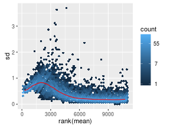
</div>


Transformation of count data - rlog
========================================================

<div align="topright">
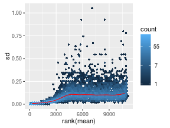
</div>

Transformation of count data - vst
========================================================

<div align="center">
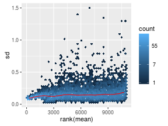
</div>


Data quality assessment 
========================================================

Data quality assessment and quality control  are essential steps
of any data analysis. These steps should typically be performed very early in the analysis of a new data set,
preceding or in parallel to the differential expression testing.

We will use following visualization tools to assess the data quality.

* Heatmap of count matrix

* Heatmap of sample to sample distances

* Principal component analysis plot


Heatmap of the count matrix (rld)
========================================================

To explore a counts matrix, it is often useful to look it as heatmap.


```r
library("pheatmap")
select <-order(rowMeans(counts(dds,normalized=TRUE)),decreasing=TRUE)[1:20]

pheatmap(assay(rld)[select,])
```

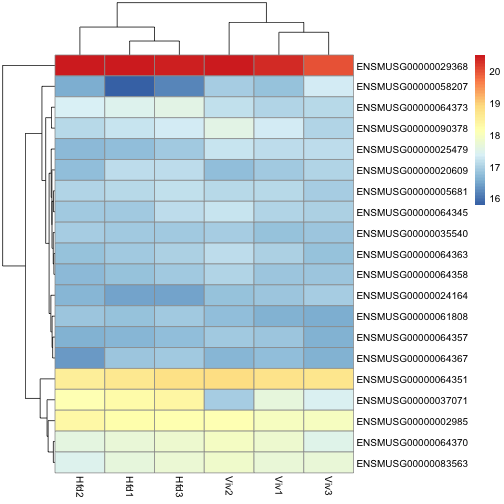


Heatmap of the count matrix (vsd)
========================================================


```r
pheatmap(assay(vsd)[select,])
```

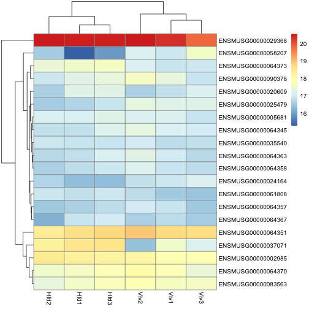


Heatmap of sample to sample distances
========================================================

Another use of the transformed data is sample clustering. Here, we apply the dist function to the transpose
of the transformed count matrix to get sample-to-sample distances. 

The assay function is used to extract the matrix of normalized values.


```r
sampleDists <- dist(t(assay(rld)))
```

========================================================

 Save the plot as png file


```r
sampleDistMatrix <- as.matrix(sampleDists)

library("RColorBrewer")
png(file="sample_dis_map.png")
rownames(sampleDistMatrix) <- rld$Group
colnames(sampleDistMatrix) <- NULL
colors <- colorRampPalette( rev(brewer.pal(9, "Blues")) )(255)
pheatmap(sampleDistMatrix,
         clustering_distance_rows=sampleDists,
         clustering_distance_cols=sampleDists,
         col=colors)

dev.off()
```

```
quartz_off_screen 
                3 
```


=======================================================

<div align="center">
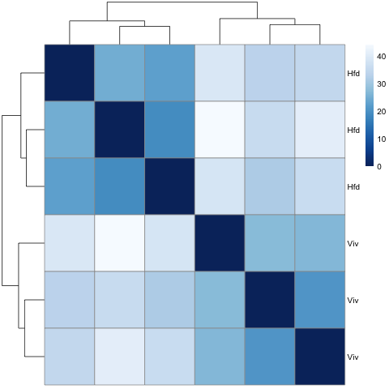
</div>


Principal component plot of the samples
========================================================

**PCA plot** is useful to spot individual sample outliers. 


```r
plotPCA(rld, intgroup="Group")
```

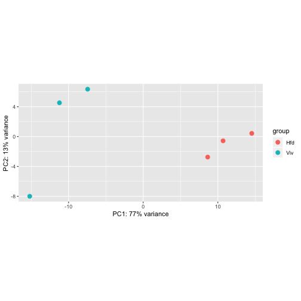

```r
# save the plot

library(ggplot2)
ggsave(file="PCA_plot_version1.png")
```

Variations to standard workflow
========================================================


**Factor levels**

By default, R will choose a reference level for factors based on alphabetical order. 
The comparisons will be based on the alphabetical order of the levels. We can either explicitly tell results which comparison to make using the contrast argument (this will be shown later), or
we can explicitly set the factors levels.

**Setting the factor levels**

cData$Group <- factor(cData$Group, levels=c("Viv","Hfd"))

or using relevel, just specifying the reference level:


```r
cData$Group<-relevel(cData$Group,ref="Viv")
```


=========================================================

**Using Contrasts**

Contrasts enable the user to generate results for all  possible
comparisons: 

Consider an experimental design containing a factor with three levels, say A, B and C.
We can use contrasts to compare B vs A, of C vs A, and C vs B.


```r
    res_contrast<-results(dds,contrast=c("Group","Hfd","Viv")) 

    
    summary(res_contrast)
```

```

out of 22605 with nonzero total read count
adjusted p-value < 0.1
LFC > 0 (up)       : 1459, 6.5%
LFC < 0 (down)     : 992, 4.4%
outliers [1]       : 7, 0.031%
low counts [2]     : 5916, 26%
(mean count < 3)
[1] see 'cooksCutoff' argument of ?results
[2] see 'independentFiltering' argument of ?results
```


Exercises
=========================================================

* [RNAseq Visualization Exercises](exercise/Exercises_Visualization.html)

Solutions
=========================================================

* [RNAseq Visualization Solutions](exercise/Answers_Visualization.html)


Gene Ontology and Pathway Enrichment Analysis
========================================================
id: go

We will perform GO analysis using goseq package.

 In order to perform a GO analysis of your RNA-seq data,goseq only requires a simple named vector, which contains two pieces of information.

1 **Measured genes**
   
 all genes for which RNA-seq data was gathered for your experiment.  Each element of your vector should be named by a unique gene identifier.

2 **Differentially expressed genes**
   
 each element of your vector should be either a 1 or 0, where 1 indicates that the gene is differentially expressed and 0 that it is not.


========================================================


```r
library(KEGG.db)
library(goseq)

# remove the NAs

resdat<- res[complete.cases(res$padj),]
 
degenes<-as.integer(resdat$padj<0.05)
names(degenes)<-rownames(resdat)
    
# remove duplicate gene names
degenes<-degenes[match(unique(names(degenes)),names(degenes))]

table(degenes)
```

```
degenes
    0     1 
14712  1970 
```


========================================================

**Fitting the probability weighting function (PWF)**

We first need to obtain a weighting for each gene, 
depending on its length, given by the PWF


```r
pwf=nullp(degenes,genome="mm9",'ensGene', plot.fit=FALSE)
  
  head(pwf)
```

```
                   DEgenes bias.data       pwf
ENSMUSG00000025902       0    3190.5 0.1316076
ENSMUSG00000033845       1     830.0 0.1052353
ENSMUSG00000025903       0     938.0 0.1103089
ENSMUSG00000033813       0    2565.0 0.1316076
ENSMUSG00000062588       0     604.0 0.0932679
ENSMUSG00000033793       0    1907.0 0.1312570
```

========================================================


```r
   plotPWF(pwf)
```

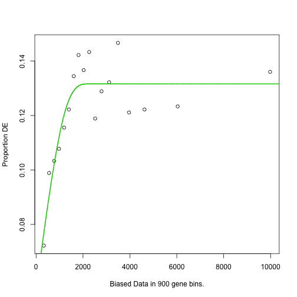

========================================================

Change the Keggpath id to name in the goseq output


```r
xx <- as.list(KEGGPATHID2NAME)
temp <- cbind(names(xx),unlist(xx))
    
addKeggTogoseq <- function(JX,temp){
  for(l in 1:nrow(JX)){
      if(JX[l,1] %in% temp[,1]){
          JX[l,"term"] <- temp[temp[,1] %in% JX[l,1],2]
          JX[l,"ontology"] <- "KEGG"
      }
  }
  return(JX)
}
```

========================================================

 Calculate  the  over  and  under  expressed  GO
categories among DE genes


```r
go<-goseq(pwf,genome="mm9",'ensGene', test.cats=c("GO:BP","GO:MF","KEGG"))
```

========================================================

```r
head(go)
```

```
        category over_represented_pvalue under_represented_pvalue
2454  GO:0005201            1.106093e-28                        1
2657  GO:0006082            1.303400e-27                        1
9909  GO:0043436            3.821805e-27                        1
6089  GO:0019752            1.054196e-25                        1
10158 GO:0044281            3.538608e-25                        1
9368  GO:0042221            4.263561e-24                        1
      numDEInCat numInCat                                        term
2454          62      105 extracellular matrix structural constituent
2657         218      829              organic acid metabolic process
9909         213      808                   oxoacid metabolic process
6089         204      778           carboxylic acid metabolic process
10158        321     1483            small molecule metabolic process
9368         513     2744                        response to chemical
      ontology
2454        MF
2657        BP
9909        BP
6089        BP
10158       BP
9368        BP
```

========================================================

```r
restemp<-addKeggTogoseq(go,temp)   

head(restemp)
```

```
        category over_represented_pvalue under_represented_pvalue
2454  GO:0005201            1.106093e-28                        1
2657  GO:0006082            1.303400e-27                        1
9909  GO:0043436            3.821805e-27                        1
6089  GO:0019752            1.054196e-25                        1
10158 GO:0044281            3.538608e-25                        1
9368  GO:0042221            4.263561e-24                        1
      numDEInCat numInCat                                        term
2454          62      105 extracellular matrix structural constituent
2657         218      829              organic acid metabolic process
9909         213      808                   oxoacid metabolic process
6089         204      778           carboxylic acid metabolic process
10158        321     1483            small molecule metabolic process
9368         513     2744                        response to chemical
      ontology
2454        MF
2657        BP
9909        BP
6089        BP
10158       BP
9368        BP
```


========================================================

```r
write.table(restemp,file="GO_Kegg_Wallenius.txt", row.names=F,sep="\t")

write.csv(restemp,file="GO_Kegg_Wallenius.csv", row.names=F)
```


Exercises
=========================================================

* [RNAseq GO Exercises](exercise/Exercise_FunctionalAnalysis.html)


Solutions
=========================================================

* [RNAseq GO Solutions](exercise/Answers_FunctionalAnalysis.html)

Session Information
========================================================

```r
    sessionInfo()
```

```
R version 3.6.1 (2019-07-05)
Platform: x86_64-apple-darwin15.6.0 (64-bit)
Running under: macOS High Sierra 10.13.6

Matrix products: default
BLAS:   /Library/Frameworks/R.framework/Versions/3.6/Resources/lib/libRblas.0.dylib
LAPACK: /Library/Frameworks/R.framework/Versions/3.6/Resources/lib/libRlapack.dylib

Random number generation:
 RNG:     Mersenne-Twister 
 Normal:  Inversion 
 Sample:  Rounding 
 
locale:
[1] en_GB.UTF-8/en_GB.UTF-8/en_GB.UTF-8/C/en_GB.UTF-8/en_GB.UTF-8

attached base packages:
[1] stats4    parallel  stats     graphics  grDevices utils     datasets 
[8] methods   base     

other attached packages:
 [1] org.Mm.eg.db_3.8.2          goseq_1.36.0               
 [3] geneLenDataBase_1.20.0      BiasedUrn_1.07             
 [5] KEGG.db_3.2.3               AnnotationDbi_1.46.1       
 [7] ggplot2_3.2.1               gplots_3.0.1.1             
 [9] RColorBrewer_1.1-2          pheatmap_1.0.12            
[11] biomaRt_2.40.4              DESeq2_1.24.0              
[13] SummarizedExperiment_1.14.1 DelayedArray_0.10.0        
[15] BiocParallel_1.18.1         matrixStats_0.54.0         
[17] Biobase_2.44.0              GenomicRanges_1.36.0       
[19] GenomeInfoDb_1.20.0         IRanges_2.18.1             
[21] S4Vectors_0.22.0            BiocGenerics_0.30.0        
[23] knitr_1.24                 

loaded via a namespace (and not attached):
 [1] nlme_3.1-141             bitops_1.0-6            
 [3] bit64_0.9-7              progress_1.2.2          
 [5] httr_1.4.1               tools_3.6.1             
 [7] backports_1.1.4          R6_2.4.0                
 [9] rpart_4.1-15             KernSmooth_2.23-15      
[11] mgcv_1.8-28              Hmisc_4.2-0             
[13] DBI_1.0.0                lazyeval_0.2.2          
[15] colorspace_1.4-1         nnet_7.3-12             
[17] withr_2.1.2              tidyselect_0.2.5        
[19] gridExtra_2.3            prettyunits_1.0.2       
[21] bit_1.1-14               compiler_3.6.1          
[23] htmlTable_1.13.1         rtracklayer_1.44.2      
[25] labeling_0.3             caTools_1.17.1.2        
[27] scales_1.0.0             checkmate_1.9.4         
[29] genefilter_1.66.0        Rsamtools_2.0.0         
[31] stringr_1.4.0            digest_0.6.20           
[33] foreign_0.8-72           XVector_0.24.0          
[35] base64enc_0.1-3          pkgconfig_2.0.2         
[37] htmltools_0.3.6          highr_0.8               
[39] htmlwidgets_1.3          rlang_0.4.0             
[41] rstudioapi_0.10          RSQLite_2.1.2           
[43] gtools_3.8.1             acepack_1.4.1           
[45] dplyr_0.8.3              RCurl_1.95-4.12         
[47] magrittr_1.5             GO.db_3.8.2             
[49] GenomeInfoDbData_1.2.1   Formula_1.2-3           
[51] Matrix_1.2-17            Rcpp_1.0.2              
[53] munsell_0.5.0            stringi_1.4.3           
[55] zlibbioc_1.30.0          grid_3.6.1              
[57] blob_1.2.0               gdata_2.18.0            
[59] crayon_1.3.4             lattice_0.20-38         
[61] Biostrings_2.52.0        splines_3.6.1           
[63] GenomicFeatures_1.36.4   annotate_1.62.0         
[65] hms_0.5.0                locfit_1.5-9.1          
[67] zeallot_0.1.0            pillar_1.4.2            
[69] geneplotter_1.62.0       codetools_0.2-16        
[71] XML_3.98-1.20            glue_1.3.1              
[73] evaluate_0.14            latticeExtra_0.6-28     
[75] data.table_1.12.2        vctrs_0.2.0             
[77] gtable_0.3.0             purrr_0.3.2             
[79] assertthat_0.2.1         xfun_0.9                
[81] xtable_1.8-4             survival_2.44-1.1       
[83] tibble_2.1.3             GenomicAlignments_1.20.1
[85] memoise_1.1.0            cluster_2.1.0           
```
